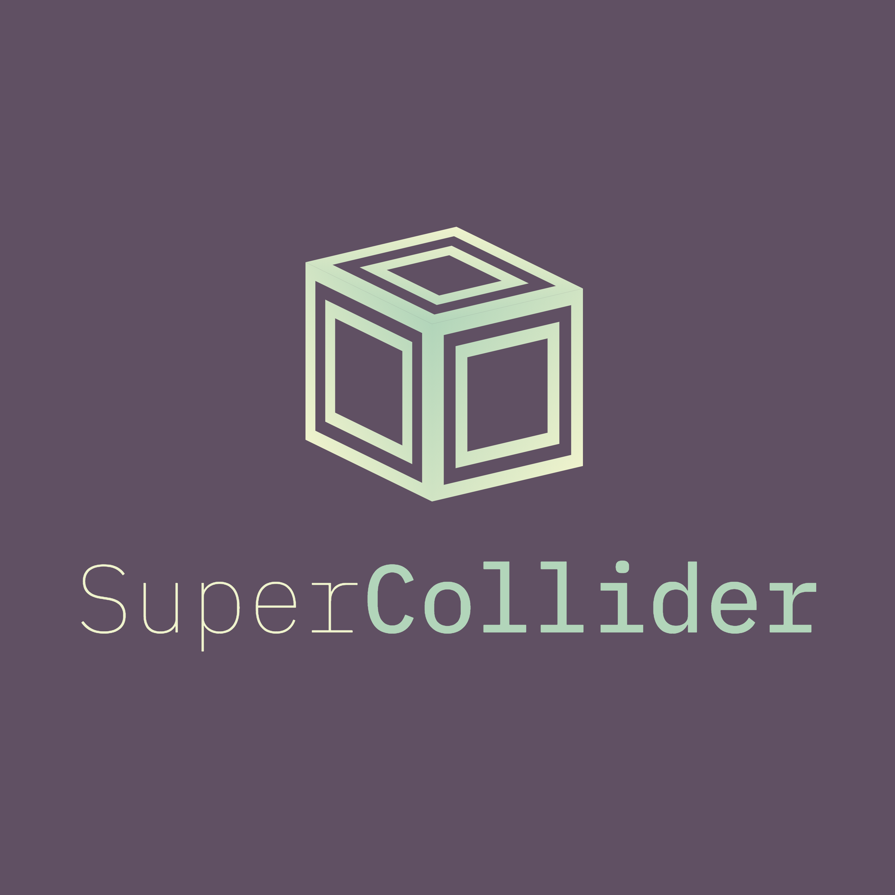

# SuperCollider Mark

This is the code for an ongoing redesign experiment for the branding.

It is built using the [canvas-sketch](https://github.com/mattdesl/canvas-sketch) library and command line tool.

## Installation

First make sure you have a recent node and npm installation.

Then, install globally canvas-sketch 

```
npm install canvas-sketch-cli -g
```

Now clone this repo

```
git clone git@github.com:chrism/supercollider-mark.git
```

Within the cloned directory run npm

```
npm install
```

Then start the `canvas-sketch` server with

```
canvas-sketch logo.js
```

You should then be able to view the logo in your browser at [http://192.168.1.11:9966/](http://192.168.1.11:9966/)

## How it works

Everytime you refresh your browser or save the `logo.js` file it will generate a new design.

The code uses a seed generator random choice of

- font combinations (from a selection of open source [IBM Plex variations and weights](https://www.ibm.com/plex/))
- colors (from a selection taken from the most popular palettes on [Colour Lovers](http://colourlovers.com/) using [nice-color-palettes](https://github.com/Jam3/nice-color-palettes))

When seeing a combination you like you can save it as a PNG file by making sure the browser is focused (clicking on the artwork) and using ⌘S to save it.

You'll note that each image file has a suffix of a string of numbers, that refers to the seed value, so it can be regenerated if required.

## Drawing the icon

The icon is based upon the [original svg file](https://github.com/supercollider/supercollider/blob/develop/icons/sc_logo.svg) and uses the same julia code to rotate the faces.

```
B = [[0,0,1] [1024,0,1] [0,1024,1]]
o = [556,556]
s = [0,595]
e = [506,-119]
se = [424,207]
points = hcat(o+e,o,o+se+e,o+se,o+s,o+s+se+e,o+s+se)
rects = Vector[[4,3,7],[2,4,5],[1,3,2]]
for r = rects
    p = map(c -> vcat(points[:,c], [1]), r)
    p = hcat(p...)
    A = (B' \ p')'
    println(join(reshape(A[1:2,:], 6), ", "))
end
```

But, so the icon can be used at small dimensions without becoming a blur, it is simplified.

TODO: I think that there could still be some improvements to the final execution of the icon. The gradients and colour options I'm not yet satisfied with.

## Animation

One of the great things about `canvas-sketch` is it's support for animation.

I think that once the colour/type combinations are locked down it would be fun to experiment with some subtle animation of the text and spinning of the icon perhaps?

## Examples of current version

Here are some example exports from the version **20 November 2018**





